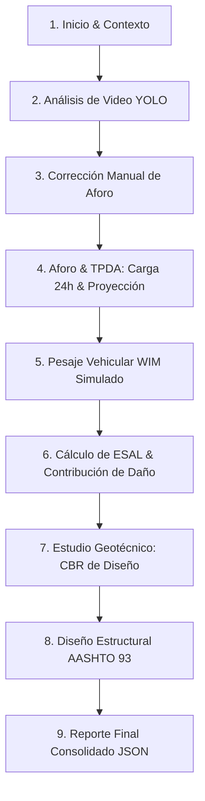

# Arquitectura Funcional y Flujo del MVP — Hackatón municipal
**Proyecto:** Pavement Intelligence (Plataforma de Análisis de Tránsito y Diseño de Pavimentos)  
**Estado:** Definición de Arquitectura del Prototipo  
**Fecha:** 2026-07-17  

---

## 1. El Recorrido del Jurado (User & Jury Journey)
Para deslumbrar al jurado en una demostración en vivo de **3 a 5 minutos**, el flujo narrativo debe contar una historia coherente y fluida. Se propone el siguiente recorrido secuencial de pantallas:

### Paso a Paso en la Demostración:
1. **Inicio & Contexto (Home):** El presentador abre la aplicación. Las métricas superiores muestran el estado del tramo *Vía Secundaria Demostrativa — La Paz* con aforos y cálculos en `❌ Pendiente` o `0`. Esto demuestra que el sistema inicia en limpio.
2. **Visión Computacional en Vivo (Análisis de Video):** Se sube el archivo `car-detection.mp4`. El presentador define una línea virtual de conteo en la pantalla y hace clic en *Procesar*. El jurado ve el video reproduciéndose con cuadros de tracking y el conteo acumulándose en tiempo real por clases (autos, motos, camiones, buses).
3. **El Factor Robustez (Corrección Manual):** El presentador muestra la tabla de edición y aclara al jurado: *"Las IAs de visión pueden cometer pequeños errores en condiciones climáticas adversas o de luz; por eso, nuestra plataforma permite a los ingenieros auditar y corregir manualmente los aforos detectados antes de procesar los datos de diseño"*. El presentador corrige un vehículo y presiona *Exportar Registros*.
4. **Ingeniería de Tránsito (Aforo & TPDA):** Se navega a la nueva pantalla de **Aforo y TPDA**. Para simular un día completo, se carga un archivo de aforo de 24 horas. Se ingresa el Factor Estacional ($f_e = 1.5$) y el sistema calcula el **TPDA de diseño**. Se configura un período de diseño de 20 años y una tasa de crecimiento de 4%, mostrando las proyecciones futuras en un gráfico de líneas comparando modelos lineales y exponenciales.
5. **Caracterización de Cargas (Datos de Pesaje):** Se navega a **Datos de Pesaje**. Al no contar con básculas WIM reales en la hackatón, se importa el archivo demostrativo `pesaje_vehicular.csv`. El jurado ve un gráfico de cajas (Box Plot) interactivo que ilustra la dispersión del peso bruto por tipo de vehículo y detecta sobrecargas que dañan la vía.
6. **Daño Equivalente (Cálculo ESAL):** En la pestaña **Cálculo de ESAL (W18)**, el sistema recupera el TPDA de diseño y los datos de pesaje. Se calcula el W18 (ejes equivalentes de diseño). Se muestra un gráfico circular (Pie Chart) donde se observa que, aunque los camiones representan menos del 15% del tránsito, aportan más del 90% del daño estructural a la vía (factor de impacto para el jurado).
7. **Diseño Geotécnico (Estudio de Suelo):** En **Estudio de Suelo**, se cargan las 5 muestras demostrativas de CBR. Se define un percentil de diseño del 75% y se obtiene un CBR de diseño de 4.8%, correlacionándolo automáticamente a un Módulo Resiliente de subrasante ($M_r = 7200\text{ psi}$).
8. **Estructura Vial (Diseño AASHTO 93):** En la pestaña de **Diseño de Pavimento**, el W18 calculado ($1.85 \times 10^6$) y el $M_r$ (7200 psi) se cargan automáticamente desde la sesión. Se eligen los materiales de las capas (Carpeta asfáltica, Base, Subbase), y la ecuación AASHTO 93 calcula el Número Estructural Requerido ($SN = 3.84$) y valida que los espesores de las capas cumplan con dicho valor. El jurado visualiza el perfil del pavimento en un gráfico apilado interactivo.
9. **Entregables (Reportes):** Se navega a **Reportes y Exportación**. El jurado ve que todos los módulos están en verde (`✅ Listo`). Se descarga el reporte JSON consolidado que contiene la memoria de cálculo lista para firmas.

---

## 2. Pantallas Mínimas Necesarias
El MVP de Streamlit requiere las siguientes 8 páginas integradas en la barra lateral izquierda:

1. **`home.py` (Página de Inicio):** 
   - Tablero con el resumen del proyecto vial.
   - 4 Tarjetas de estado dinámicas (`aforos_registrados`, `muestras_suelo`, `esal_calculado`, `diseno_calculado`).
   - Guía interactiva del flujo de trabajo y carga del caso demostrativo.
2. **`video_analysis.py` (Análisis de Video):** 
   - Cargador de video (MP4/AVI).
   - Configuración gráfica del modelo YOLO y coordenadas de la línea virtual de conteo.
   - Renderizador del video procesado con bounding boxes.
   - Tabla interactiva (`st.data_editor`) para corregir clases y sentidos detectados por la IA.
   - Botón de exportación rápida a JSON/CSV.
3. **`survey_tpda.py` (Aforo y TPDA - *NUEVA PANTALLA A IMPLEMENTAR*):**
   - Importador de archivos de aforo (CSV de 24h o 7 días).
   - Selector de factores correctivos de la ABC: Factor de Nocturnidad ($f_n$) y Factor de Estacionalidad Mensual ($f_e$).
   - Formulario para ingreso manual del TPD base si no se cuenta con video o archivo.
   - Gráfico de barras de distribución horaria del tránsito.
   - Sección de proyecciones futuras (lineal vs. exponencial/compuesto a $n$ años) con gráfico de tendencias.
   - Botón para guardar resultados en la sesión (`st.session_state.tpda_result`).
4. **`weighing.py` (Datos de Pesaje Vehicular):**
   - Cargador de archivos de pesaje en báscula.
   - Tabla de vista previa de registros (timestamp, categoría vehicular, peso bruto, peso por eje).
   - Estadísticas resumen y Box Plot de distribución de peso por categoría.
5. **`esal_calculator.py` (Cálculo de ESAL):**
   - Recuperación automática del TPDA de sesión o ingreso manual por categoría.
   - Tabla interactiva de Factores de Equivalencia de Carga (FEC) editable por el usuario.
   - Configuración de factores de distribución direccional (FDD), de carril (FDC) y tasa de crecimiento.
   - Visualización del W18 total y Pie Chart de contribución de daño estructural.
6. **`soil_study.py` (Estudio de Suelo y Subrasante):**
   - Formulario de registro de muestras de suelo (Progresiva, SUCS, AASHTO, CBR saturado, Expansión).
   - Tabla resumen de muestras del tramo y botón de carga de muestras demostrativas.
   - Selector de percentil de diseño (AASHTO recomienda 75-85%).
   - Cálculo del CBR de diseño y correlación a Módulo Resiliente ($M_r$).
   - Gráfico del perfil de CBR a lo largo del tramo.
7. **`pavement_design.py` (Diseño de Pavimento Flexible):**
   - Carga de W18 y Módulo Resiliente de subrasante desde sesión o entrada manual.
   - Controles deslizantes para parámetros AASHTO: Confiabilidad ($R$), Desviación Estándar Global ($S_0$), Serviciabilidad Inicial ($p_0$) y Terminal ($p_t$).
   - Configuración de coeficientes de capa ($a_i$), coeficientes de drenaje ($m_i$) y espesores iniciales ($D_i$) para 3 capas.
   - Resolución automática mediante el método de bisección del $SN_{\text{requerido}}$ y balance con $SN_{\text{provisto}}$.
   - Gráfico horizontal interactivo del paquete de pavimento propuesto.
8. **`reports.py` (Reportes y Exportación):**
   - Semáforo de estado de todos los módulos calculados.
   - Botón de generación y descarga del reporte técnico consolidado en formato JSON.
   - Descarga de la tabla de muestras de suelos registradas.

---

## 3. Matriz de Flujo de Datos
A continuación, se detalla qué datos recibe y entrega cada módulo del sistema:

| Módulo | Datos de Entrada (Origen) | Datos de Salida (Destino) | Variables Clave |
| :--- | :--- | :--- | :--- |
| **Análisis de Video** | Archivo de video (Carga directa) + pesos YOLO (`data/models/yolov8n.pt`) | Registros de conteo por clase en crudo (`st.session_state.events`) | `track_id`, `category` (CAR, BUS, TRUCK, etc.), `direction` |
| **Aforo y TPDA** | Registros corregidos de video o archivo CSV de aforo (`data/samples/`) | TPDA corregido y proyecciones de tránsito (`st.session_state.tpda_result`) | `TPDA_diseño`, `V_f` (Tránsito final), `V_T` (Volumen acumulado), `f_e` (Factor mensual) |
| **Datos de Pesaje** | CSV de pesaje en báscula (`pesaje_vehicular.csv`) | Estadísticas de peso bruto e histórico de cargas por eje (`st.session_state.pesaje_df`) | `gross_weight_kn`, `axle1_load_kn`, `category_id` |
| **Cálculo de ESAL** | `tpda_result` (Aforo y TPDA) + Catálogo de FEC (Editable o derivado de pesaje) | W18 total acumulado de diseño (`st.session_state.esal_result`) | `W18_total`, `FCA` (Factor de crecimiento acumulado), `FDD`, `FDC` |
| **Estudio de Suelo** | Muestras geotécnicas (Ingreso manual o muestras demo) | CBR de diseño y Módulo Resiliente de subrasante (`st.session_state.cbr_diseno` / `mr_psi`) | `CBR_diseño`, `M_r_psi` |
| **Diseño Pavimento** | `W18_total` (ESAL) + `M_r_psi` (Suelos) + Parámetros de confiabilidad/capas | Estructura de capas aprobada y $SN$ verificado (`st.session_state.diseno_result`) | `SN_requerido`, `SN_provisto`, `D_1` (Asfalto), `D_2` (Base), `D_3` (Subbase) |
| **Reportes** | Resultados consolidados de todos los módulos anteriores (`st.session_state`) | Archivo JSON de reporte final | `pavement_intelligence_reporte.json` |

---

## 4. Estado de Madurez de Datos (Datos Reales vs. Demostrativos)
Para que el sistema sea viable durante la hackatón sin depender de sensores en tiempo real ni de laboratorios físicos in situ, se define el siguiente uso de datos:

* **Datos Reales (En vivo):**
  - *Visión artificial:* El análisis y clasificación se ejecuta sobre el video MP4 real que suba el usuario mediante el modelo YOLOv8.
  - *Cálculos estructurales:* Las fórmulas del método de diseño AASHTO 93 e integrales de tránsito son cálculos matemáticos exactos en tiempo real.
* **Datos Demostrativos / Simulados (Carga rápida con un clic):**
  - *Aforos de larga duración:* Como el video procesado es corto (pocos minutos), se requiere un aforo simulado de 24 horas para poder calcular el TPDA. Se cargará desde `data/samples/caso_demostrativo/aforo_24h.csv`.
  - *Pesaje vehicular WIM:* Archivo CSV preestablecido con 50 registros de pesaje pesado simulados (`pesaje_vehicular.csv`) debido a que no hay básculas WIM reales.
  - *Muestras de suelo:* Un conjunto de 5 muestras geotécnicas con datos de Proctor y CBR simulados en base a suelos típicos de La Paz para evitar el tipeo en vivo de datos de laboratorio.
* **Entrada Manual (Criterio del Usuario):**
  - Factores estacionales ($f_e$), tasas de crecimiento ($r$), periodo de diseño ($P$), nivel de confiabilidad ($R$), desviación global ($S_0$), coeficientes estructurales de capas ($a_i$) y coeficientes de drenaje ($m_i$).

---

## 5. Simulación Temporal del Pesaje Vehicular (WIM)
Dado que los sensores WIM (Weigh-In-Motion) reales no están implementados en el tramo de prueba, se presentará el pesaje de la siguiente manera para la hackatón:

1. **Importación de Historial:** La pantalla **Datos de Pesaje** cargará un CSV demostrativo que representa la base de datos de una estación de pesaje WIM virtual instalada en la vía. Esto permite caracterizar los pesos reales (peso bruto y cargas por eje) por cada categoría vehicular de la ABC.
2. **Visualización de Sobrecargas:** Se mostrará de forma gráfica la dispersión del peso mediante diagramas de caja (Box Plots) comparándolos con los límites legales de la **Ley 441 de Conservación Vial de Bolivia**. Esto permitirá al jurado entender cómo se identifican los vehículos infractores.
3. **Asociación Placa-Pesaje (Visualización Conceptual):** Se presentará una tabla estática o simulada en la interfaz que asocie las placas leídas (mediante el módulo de OCR conceptual) con los pesos registrados en la báscula WIM del CSV, demostrando cómo se detecta en tiempo real un camión con sobrecarga que daña el pavimento.

---

## 6. Resultados, Tablas y Gráficos Imprescindibles
Para lograr un impacto visual premium ("WOW") acorde a los requisitos de desarrollo, los siguientes componentes interactivos de **Plotly** son obligatorios:

1. **Detección de Tránsito (Visión):**
   - Video procesado con superposición de la línea virtual de aforo.
   - Tabla de conteos rápidos por categoría y sentido.
2. **Distribución Horaria del Aforo (Tránsito):**
   - Gráfico de barras interactivo que muestre el volumen vehicular hora por hora en las 24 horas del día.
3. **Proyección del Tránsito (Tránsito):**
   - Gráfico de líneas que muestre el crecimiento del volumen de tráfico a lo largo de los 20 años de vida útil, contrastando el modelo lineal académico con el modelo exponencial AASHTO.
4. **Dispersión de Carga WIM (Pesaje):**
   - Diagrama de caja (Box Plot) interactivo de pesos brutos por tipo de vehículo (C2, C3, BUS, etc.), con líneas de referencia rojas que marquen los límites legales de la Ley 441.
5. **Contribución al Daño (ESAL):**
   - Gráfico circular (Pie Chart) de los ESALs totales acumulados por clase de vehículo para ilustrar que los vehículos pesados (C3, articulados) generan casi la totalidad del daño al pavimento.
6. **Perfil de CBR (Geotecnia):**
   - Gráfico de barras verticales por muestra geológica con una línea horizontal punteada que marque el CBR de diseño final.
7. **Estructura del Pavimento (Diseño):**
   - Gráfico de barra horizontal apilada (Stacked Bar Chart) que dibuje a escala los espesores físicos (cm) de la Carpeta Asfáltica, Base Granular y Subbase Granular.

---

## 7. Advertencias de Validación e Integridad Técnica
El sistema debe incluir alertas dinámicas en Streamlit (`st.warning`, `st.error`, `st.info`) para validar el rigor de la ingeniería vial:

* **Advertencia de Datos Simulados:** Se debe mostrar un cartel naranja persistente en la parte superior de las pantallas de Pesaje y Suelos cuando se estén utilizando los sets de datos del caso demostrativo.
* **Subrasante Débil (CBR < 3%):** Si el CBR de diseño resultante del percentil es inferior al 3%, el sistema debe bloquear el diseño directo e indicar: *"Subrasante de muy baja capacidad de soporte. Se requiere estabilización química con cal/cemento o sustitución por suelo seleccionado antes de continuar con el diseño estructural."*
* **Inconsistencia Metodológica en Proyección Lineal:** Al seleccionar la proyección lineal académica (Variante A), el sistema debe mostrar una alerta: *"El método de reproducción documental mezcla volúmenes brutos y expandidos, subestimando el volumen acumulado de diseño. Para fines de pavimentación reales, utilice el Método de Base Homogénea (Variante B) o el modelo exponencial AASHTO."*
* **Espesores Mínimos AASHTO:** Si el usuario propone espesores por debajo de los límites recomendados por AASHTO según el nivel de W18 (por ejemplo, carpeta asfáltica de menos de 5 cm), el sistema debe mostrar una alerta de advertencia.
* **Disclaimer Legal:** En el módulo de reportes y en el diseño estructural, se debe colocar un aviso legal en color rojo: *"Los resultados son de carácter demostrativo y educativo. No reemplazan un estudio de ingeniería de carreteras formal firmado por un profesional habilitado."*

---

## 8. Funciones Excluidas del MVP (Fuera de Alcance)
Para garantizar la entrega a tiempo de la hackatón y evitar dependencias complejas, quedan **fuera de alcance**:
- **Reconocimiento de Placas (OCR) funcional en tiempo real:** Se manejará únicamente a nivel de visualización conceptual o mockup, debido a su alto consumo de recursos y dependencias de instalación (PaddleOCR).
- **Diseño de Pavimento Rígido:** Aunque existen hojas de cálculo en el directorio, el MVP del panel Streamlit se enfocará exclusivamente en Pavimento Flexible AASHTO 93.
- **Cálculo de factores de drenaje ($m_i$) automáticos:** Se ingresarán manualmente como hipótesis de diseño en lugar de calcularlos mediante datos climáticos de lluvia en tiempo real.
- **Conectores físicos con sensores WIM:** Toda la ingesta de cargas se resolverá mediante la importación de archivos CSV estáticos.

---

## 9. Propuesta de Orden de Implementación
Se recomienda seguir este orden de desarrollo por fases para no interferir con el trabajo de visión artificial que está ejecutando Codex:

* **Fase 1: Implementación del Backend de Tránsito:** Desarrollar el archivo de dominio de TPDA y las lógicas de proyección lineal y exponencial en `pavement_intelligence.traffic`.
* **Fase 2: Construcción de la Interfaz de Aforo y TPDA (`survey_tpda.py`):** Crear la pantalla vacía actual e integrar la carga de archivos, la visualización horaria y las proyecciones de tránsito en Streamlit.
* **Fase 3: Integración de la Trazabilidad y Estado de Sesión:** Conectar `st.session_state` para que los datos de visión (`events`) alimenten la pantalla de TPDA; el TPDA alimente a `esal_calculator.py`; y el ESAL y CBR alimenten a `pavement_design.py`.
* **Fase 4: Empaquetamiento de Datos Demostrativos:** Crear los archivos CSV de muestra en `data/samples/caso_demostrativo/` (aforo de 24h, pesaje vehicular y muestras de suelo).
* **Fase 5: Incorporación de Alertas de Validación y Disclaimer:** Añadir los carteles de advertencia de ingeniería vial y refinar el diseño visual del panel Streamlit.

---

## 10. División de Trabajo (Matriz de Responsabilidades)

| Tarea / Componente | Antigravity (Tú) | Codex (Compañero) | Trabajo Manual (Usuario) |
| :--- | :--- | :--- | :--- |
| **Arquitectura y Diseño de UI** | 🟢 Principal (Definir flujos y wireframes de las pantallas) | ⚪ No interviene | 🔵 Retroalimentación y validación de diseño |
| **Inferencia y Tracking YOLO** | ⚪ No modificar | 🟢 Principal (Afinar detección de clases, tracking de IDs y línea virtual) | 🔵 Grabar y proveer los videos de tráfico de prueba |
| **Backend de Tránsito (TPDA)** | ⚪ No interviene | 🟢 Principal (Implementar clases pydantic y funciones de cálculo/proyección) | ⚪ No interviene |
| **Interfaz Streamlit (`ui/pages/`)** | 🟢 Principal (Crear pantallas de TPDA, suelos, diseño estructural y reportes) | ⚪ No interviene | 🔵 Ejecutar la UI localmente y realizar pruebas de caja negra |
| **Datos Demostrativos** | 🟢 Principal (Estructurar los CSV de suelos, pesajes y aforos de muestra) | ⚪ No interviene | 🔵 Proveer valores típicos locales para poblar la demo |
| **Verificación de Fórmulas** | 🟢 Principal (Verificar que los cálculos de AASHTO 93 y ESAL coincidan con las hojas excel del proyecto) | 🔵 Apoyar con tests unitarios | 🟢 Principal (Revisión técnica final de los resultados del diseño) |
