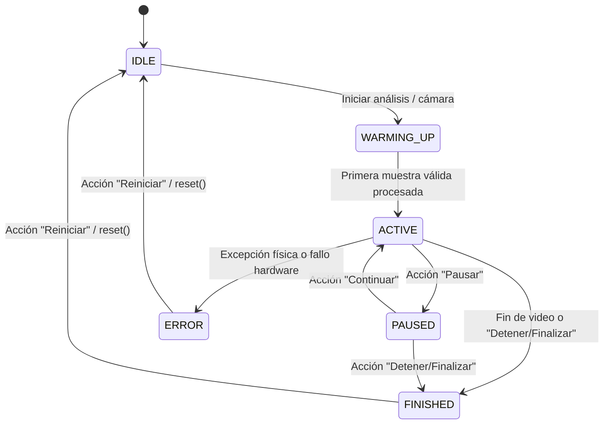

# Arquitectura de Monitoreo con Doble Fuente Independiente

Este documento define la arquitectura técnica para procesar y supervisar de forma independiente dos fuentes visuales distintas en el proyecto Pavement Intelligence: una panorámica para el conteo/clasificación de tránsito y otra de primer plano para el reconocimiento OCR de matrículas.

---

## 1. Principio de Aislamiento y Desacoplamiento

El núcleo del diseño radica en la separación absoluta de flujos de datos. Las lecturas de placas (OCR) son estrictamente experimentales y no alteran bajo ningún concepto las estadísticas de conteo vial del aforo oficial, la clasificación, el sentido de circulación, la aprobación de lotes, las transferencias a TPDA/ESAL ni el diseño de pavimentos.

```
                    +------------------------------------+
                    |  PUNTO DE MONITOREO (Ubicación)    |
                    +------------------------------------+
                                      |
                +---------------------+---------------------+
                |                                           |
                v                                           v
+-------------------------------+           +-------------------------------+
|  FLUJO VEHICULAR (Panorámico) |           |      FLUJO OCR (Cercano)      |
|                               |           |                               |
|  TrafficSourceSession         |           |  PlateSourceSession           |
|  -> VideoFileSource/Camera    |           |  -> VideoFileSource/Camera    |
|  -> YOLOv8 (Vehículos)        |           |  -> YOLOv8 (Recorte Placas)   |
|  -> ByteTrack                 |           |  -> PaddleOCR                 |
|  -> Conteo Cruces / Congestión|           |  -> Lectura de Placas         |
|  -> TrafficBatchId            |           |  -> PlateBatchId              |
+-------------------------------+           +-------------------------------+
                |                                           |
                v                                           v
+-------------------------------+           +-------------------------------+
|  Revisión Manual del Aforo    |           |  Revisión Manual OCR          |
|  -> Aprobación y Firma Lote   |           |  -> Auditoría Privacidad      |
+-------------------------------+           +-------------------------------+
                |                                           |
                v                                           v
+-------------------------------+           +-------------------------------+
|  survey_tpda.py -> TPDA       |           |  Asociación por Evidencia     |
|  -> esal_calculator.py -> ESAL|           |  (Asociación Futura)          |
+-------------------------------+           +-------------------------------+
```

---

## 2. Flujo de Trabajo y Ciclo de Vida de las Fuentes

El ciclo de vida de cada fuente (Tráfico y OCR) es completamente independiente y se gestiona en paralelo:



### Reglas del Ciclo de Vida Independiente:
1. **Pausa y Continuación**: Pausar la fuente de tráfico no altera la visualización o procesamiento de la fuente OCR, ni viceversa.
2. **Cierre de Recursos**: Al transicionar a `FINISHED`, `ERROR` o `IDLE`, la fuente de captura (`VideoCapture` de OpenCV) correspondiente libera su descriptor inmediatamente.
3. **Manejo de Errores**: Un error en la adquisición de la cámara OCR (por ejemplo, desconexión de puerto USB) pone la sesión OCR en `ERROR` pero permite que la sesión de Tráfico siga procesando activamente el video panorámico.

---

## 3. Estado de Sesión en Streamlit (Claves Aisladas)

Para evitar colisiones de memoria en el hilo de renderizado, se definen dos conjuntos mutuamente excluyentes de claves en `st.session_state`:

### A. Claves de la Sesión de Tránsito (`TrafficSourceSession`)
* `traffic_session_active_source`: Origen seleccionado (Imagen, Video, Cámara).
* `traffic_session_controller`: Instancia del controlador `TrafficAnalysisController`.
* `traffic_session_running`: Booleano que indica reproducción activa.
* `traffic_session_paused`: Booleano que indica pausa.
* `traffic_session_metadata`: Metadatos del video (FPS, resolución).
* `traffic_session_current_result`: Última estructura de `FrameAnalysisResult`.
* `traffic_session_batch_events`: Lista de `TrafficEvent` crudos acumulados en memoria.
* `traffic_session_error`: Cadena de error capturada en el flujo de tránsito.

### B. Claves de la Sesión OCR (`PlateSourceSession`)
* `plate_session_active_source`: Origen seleccionado para OCR (Imagen, Video, Cámara).
* `plate_session_controller`: Instancia del controlador `PlateAnalysisController` (nuevo).
* `plate_session_running`: Booleano que indica ejecución de lectura de placas.
* `plate_session_paused`: Booleano que indica pausa de OCR.
* `plate_session_metadata`: Metadatos de la fuente OCR.
* `plate_session_current_result`: Última estructura de `PlateAnalysisResult` (con miniaturas y lecturas).
* `plate_session_batch_readings`: Lista de `PlateReadingResult` acumulados en memoria.
* `plate_session_error`: Cadena de error capturada en el flujo de placas.

---

## 4. Política de Recursos y Concurrencia

### A. Compartición de Recursos y Límites
1. **Procesamiento Secuencial (Fase A y B)**:
   * Solo una de las dos fuentes ejecuta inferencia activa en CPU a la vez. Al alternar o pausar una, la otra adquiere el control, liberando de forma inmediata la memoria RAM/VRAM del modelo inactivo.
2. **Procesamiento Simultáneo (Fase C)**:
   * Se requiere GPU con CUDA para soportar dos hilos de inferencia (YOLOv8 de vehículos y YOLOv8 de placas).
   * Si se ejecuta en CPU, la frecuencia de inferencia del módulo OCR se limita a **1 de cada N frames** (ej. evaluar únicamente 2 frames por segundo) para evitar caídas severas de FPS en el seguimiento del aforo panorámico.
3. **Caché Compartida**:
   * Los pesos del detector YOLOv8 se cargan de forma global compartida a través de `@st.cache_resource` para evitar duplicar el consumo de VRAM en las sesiones.

---

## 5. Diseño de Asociación Futura por Evidencia (Fase D)

Dado que las dos cámaras tienen perspectivas físicas, distancias focales y ángulos diferentes, **es imposible correlacionar los vehículos usando el `track_id`**. Cada `track_id` es local a su fuente y nunca cruza de una cámara a la otra. Se diseña una asociación heurística basada en la coincidencia de evidencia espacial y temporal:

```
[Vehículo de Tránsito] (Cámara 1) -> Evento de Cruce en t_1, Sentido S, Carril C, Categoría Camión
[Placa Detectada]       (Cámara 2) -> Lectura de Placa en t_2, Sentido S, Carril C

Asociación por Ventana: |t_2 - t_1| <= Tolerancia (ej. 3.0 segundos) + Filtros de Sentido y Carril
```

### Estados del Ciclo de Asociación:
* `UNASSOCIATED`: La lectura OCR de matrícula o el evento de tránsito no se han emparejado.
* `CANDIDATE`: Se detectó un único emparejamiento probable dentro de la tolerancia temporal y espacial.
* `MANUALLY_CONFIRMED`: El operador auditó la evidencia (comparando fotograma del vehículo y recorte de placa) y validó manualmente la asociación.
* `REJECTED`: El operador descartó explícitamente la asociación automática sugerida.
* `AMBIGUOUS`: Múltiples lecturas de placas u eventos vehiculares ocurren en la misma ventana, imposibilitando la asignación automática determinista sin intervención humana.

La asociación futura es opcional, reversible y no autoritativa. El sistema solo propone candidatos basados en evidencia temporal, espacial y visual; ninguna propuesta produce efectos hasta que un operador la confirma manualmente. Una confirmación puede revocarse con trazabilidad, sin modificar el evento vehicular original, el lote OCR ni los resultados oficiales derivados del aforo.

---

## 6. Riesgos Críticos y Mitigación

* **Saturación del Servidor**: El procesamiento simultáneo en CPU de ambos hilos puede generar latencias de visualización mayores a 500ms por frame. *Mitigación*: Implementar el procesamiento de OCR por intervalos discretos o desacoplado asíncronamente en una cola en segundo plano.
* **Bloqueos de Hardware de Cámara**: Streamlit no cuenta con callbacks nativos al expirar la pestaña de sesión para cerrar descriptores de video. *Mitigación*: Incorporar destructores `__del__` y validación robusta de adquisición controlada de cámara.
